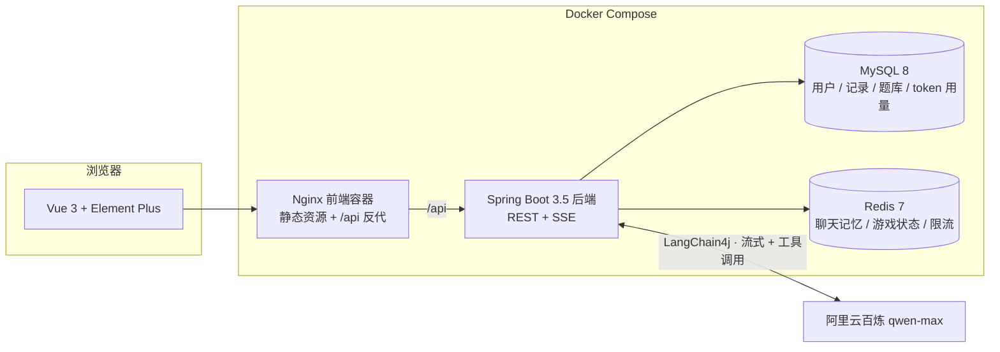
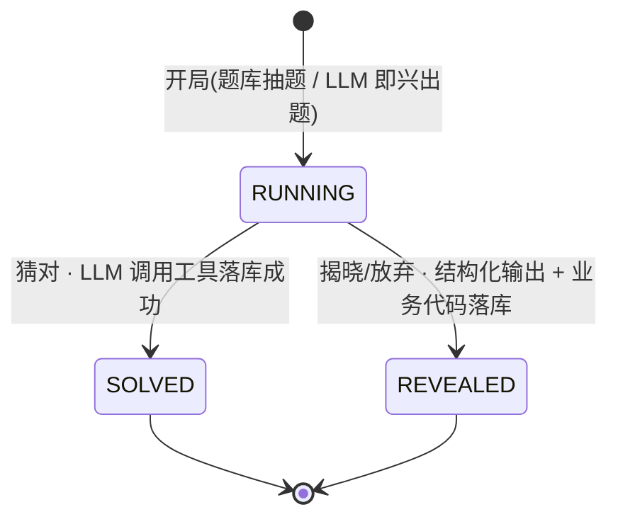
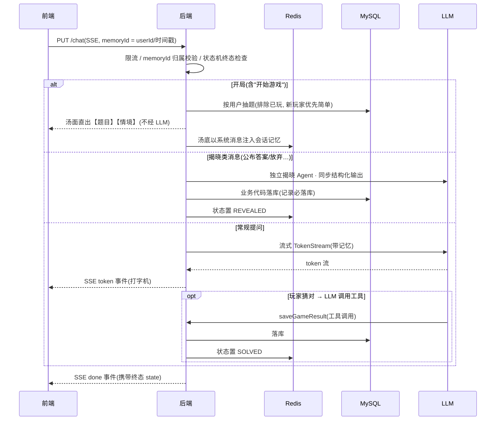
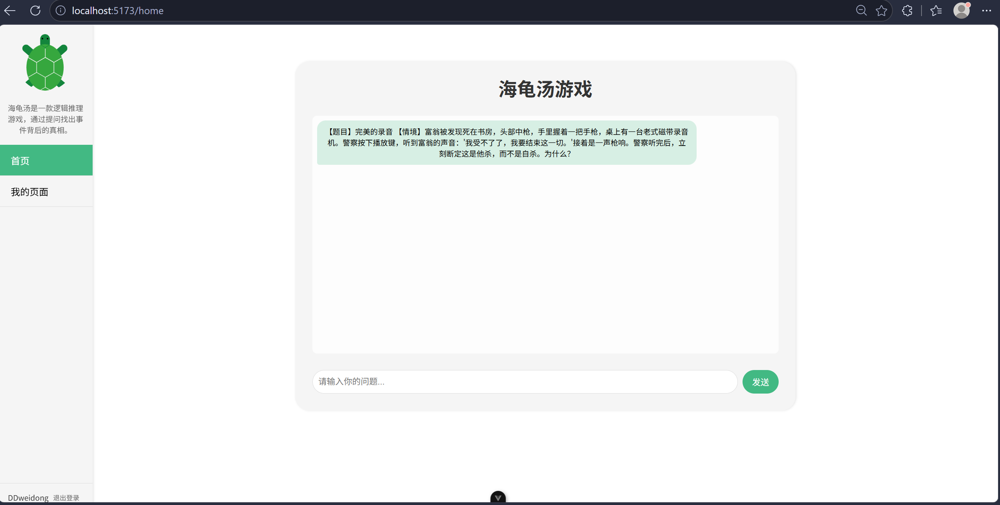
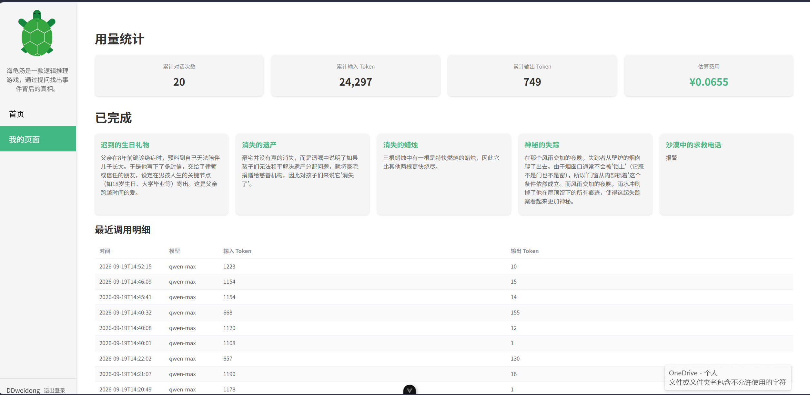
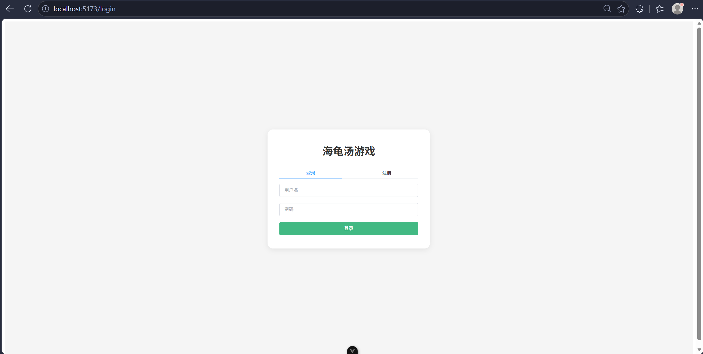
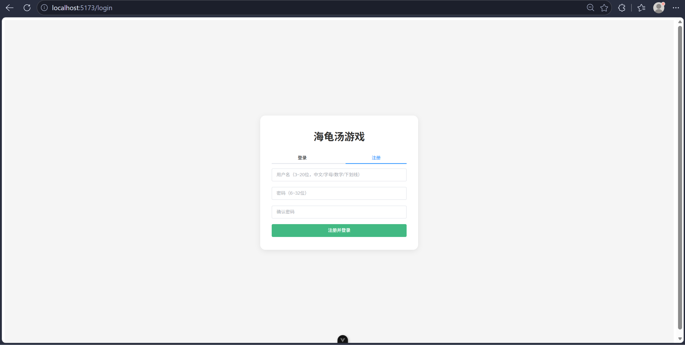

# 海龟汤 · AI 主持人推理游戏

> 由大模型担任主持人的"海龟汤"情境推理游戏:玩家通过「是 / 否 / 无关」提问逐步逼近真相,猜出完整故事即胜利。
> 后端以 LangChain4j 构建 AI Agent(工具调用、多轮记忆、流式输出),同时具备完整的企业级后端工程能力:鉴权、限流、监控、容器化部署。

## 功能特性

- **AI 主持**:qwen-max 担任主持人,严格遵守"只回答是/否/无关"的规则,支持两级提示机制
- **内置题库**:20 道自备题目按难度抽取,新玩家优先简单题;汤底注入 AI 会话记忆,保证主持人全程"知道答案";题库抽空自动回退 LLM 即兴出题
- **Agent 工具调用**:玩家猜对时 LLM 自主调用 `saveGameResult` 工具落库;游戏结束由后端 Redis 状态机兜底(RUNNING → SOLVED / REVEALED),记录必落库
- **SSE 流式输出**:token 级流式回复,打字机体验;Nginx 反代已针对 SSE 调优
- **用户体系**:Spring Security + JWT 双 token(access 30 分钟 / refresh 7 天),数据按用户隔离
- **Redis 持久化**:聊天记忆 + 游戏状态机 + 按用户限流(10 次/分钟,Lua 原子计数),服务重启记忆不丢
- **Token 用量统计**:每次模型调用按次落库,汇总/明细接口 + 前端费用估算卡片
- **一键部署**:docker compose 编排 MySQL + Redis + 后端 + 前端,healthcheck 保证启动顺序

## 系统架构



## 游戏核心流程

**游戏规则全部定义在 LLM 系统提示词中,游戏结束由后端状态机保证**(不依赖 LLM 自觉):





## 技术栈

| 层 | 技术 |
| --- | --- |
| 后端 | Java 17 · Spring Boot 3.5 · Spring Security · LangChain4j(AiServices + Tool Calling)· MyBatis-Plus · Flyway · JJWT |
| 存储 | MySQL 8 · Redis 7(记忆 / 状态机 / 限流) |
| 模型 | 阿里云百炼 qwen-max(流式 + 结构化输出) |
| 前端 | Vue 3 · Vite · Element Plus · Axios · fetch SSE |
| 部署 | Docker 多阶段构建 · Docker Compose · Nginx |

## 快速开始

### Docker Compose(推荐)

```bash
cp .env.example .env          # 填入 DB_PASSWORD / DASH_SCOPE_API_KEY / JWT_SECRET
docker compose up -d --build
```

访问 http://localhost 即可(前端由 Nginx 托管并反代 /api 到后端)。

### 本地开发

后端(需 JDK 17、本地 MySQL 8 库 `haiguitang`、Redis,环境变量 `DASH_SCOPE_API_KEY` / `DB_PASSWORD`):

```bash
cd game-backend
./mvnw spring-boot:run        # 8080 端口; Flyway 自动建表; 接口文档 /swagger-ui.html
./mvnw test                   # 21 个单元 + 集成测试(集成需本地 MySQL/Redis)
```

前端(需 Node 20+):

```bash
cd game-frontend
npm install
npm run dev                   # 5173 端口
```

## API 一览

统一响应 `Result<T>{code, message, data}`,错误码 4xxxx/5xxxx。

| 方法 | 路径 | 说明 |
| --- | --- | --- |
| POST | `/auth/register` | 注册(注册即登录,返回双 token) |
| POST | `/auth/login` | 登录 |
| POST | `/auth/refresh` | 刷新 access token |
| PUT | `/chat` | 与 AI 主持人对话(SSE:token / done / error 事件) |
| GET | `/turtle-soups` | 分页查询当前用户的完成记录 |
| POST | `/turtle-soups` | 新增完成记录(userId 取自登录态) |
| GET | `/token-usage/summary` | LLM 用量汇总(次数 / 输入输出 token / 估算费用) |
| GET | `/token-usage/records` | LLM 用量明细(分页) |

## 项目结构

```
MyHaiGuiTang
├── game-backend/                          # Spring Boot 3.5 后端
│   ├── src/main/java/com/weidong/gamebackend
│   │   ├── assistant/                     # LangChain4j AI Agent: 游戏主持 / 揭晓 / 记忆存储
│   │   ├── tool/                          # GameResultTool(LLM 自主调用的落库工具)
│   │   ├── controller/                    # Auth / Game(SSE) / TurtleSoup / TokenUsage
│   │   ├── service/                       # 游戏状态机 / 限流 / 抽题 / 用量统计
│   │   ├── security/                      # Spring Security + JWT 过滤链
│   │   ├── configuration/                 # Agent 装配 / 安全 / 分页插件 / CORS
│   │   ├── common/                        # 统一响应 / 全局异常 / 错误码
│   │   └── model/ mapper/ dto/ vo/        # 数据层
│   ├── src/main/resources
│   │   ├── db/migration/                  # Flyway V1~V5(建表 + 题库种子)
│   │   └── haiguitang-*-template.txt      # 主持人 / 揭晓 系统提示词模板
│   └── Dockerfile                         # maven 构建 → JRE 运行
├── game-frontend/                         # Vue 3 前端
│   ├── src/api/                           # http(axios 拦截器: token/解包/401 自动刷新) · sse(流式解析)
│   ├── src/views/                         # 游戏页 / 个人中心 / 登录注册
│   ├── nginx.conf                         # history 回退 + /api 反代(SSE 调优)
│   └── Dockerfile                         # node 构建 → nginx 托管
├── docker-compose.yml                     # mysql + redis + backend + frontend 一键编排
└── .env.example                           # 环境变量模板(密钥不入库)
```

## 界面预览









## 路线图

- [x] W1 工程化地基:版本升级、统一响应、分层重构、双 Profile、接口文档
- [x] W2 用户体系:JWT 双 token、数据归属隔离、前端登录改造
- [x] W3 AI 能力:Redis 记忆持久化、限流、Token 用量统计、SSE 流式、游戏状态机 + 结构化输出、内置题库
- [x] W4 工程质量:21 个单元/集成测试、Docker Compose 一键部署、README 与架构图
- [ ] P1 部署上线:云服务器 + 小范围公开
- [ ] P2 体验与成本优化:上下文压缩、记忆窗口策略等
